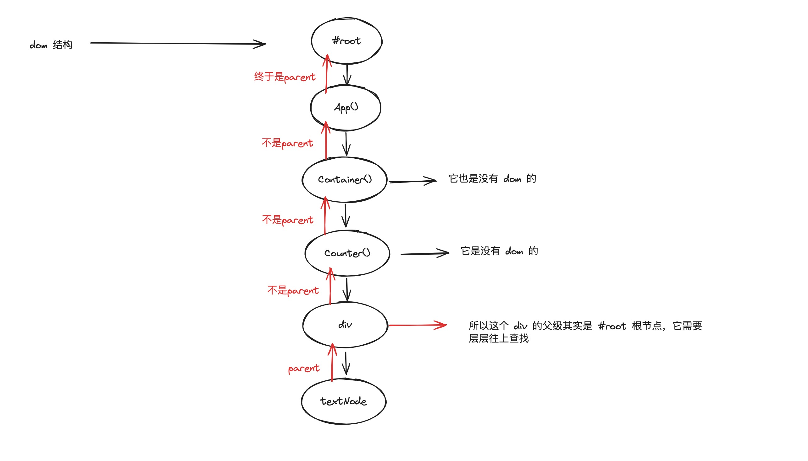

# mini-react

1. 先用原生实现如何将一个 dom 元素渲染至页面

```javascript
const divElement = document.createElement("div");
divElement.id = "app";

document.querySelector("#root").appendChild(divElement);

const textNodeEL = document.createTextNode("");
textNodeEL.nodeValue = "mini-react";

divElement.appendChild(textNodeEL);
```

2. 寻找原生创建法的共性

```javascript
/** react 将 virtual-dom 处理后渲染至页面
 * 1. 生成节点，节点的类型是动态的
 * 2. 都有一个属性: div 是 id = app , textNode 是 nodeValue = 'mini-react'
 * 3. 最后让自己的父元素把自己添加进去，最终渲染到页面上
 */
const childElement = {
  type: "TEXT_ELEMENT",
  props: {
    nodeValue: "mini-react",
    children: [],
  },
};

const element = {
  type: "div",
  props: {
    id: "app",
    children: [childElement],
  },
};

const divEl = document.createElement(element.type);
divEl.id = element.props.id;

document.querySelector("#root").appendChild(divEl);

const textNodeEl = document.createTextNode("");
textNodeEl.nodeValue = childElement.props.nodeValue;

divEl.appendChild(textNodeEl);
```

3. 再次优化 2 的内容

```javascript
/** 是不是可以转换成
 * createElement('div',{ id: 'app' }, 'hi','mini','react')
 * createElement('div',{ id: 'app' }, {type:'TEXT_ELEMENT',props:{ nodeValue:'mini-react', children:[] }})
 */
function createChild(text) {
  return {
    type: "TEXT_ELEMENT",
    props: {
      nodeValue: text,
      children: [],
    },
  };
}
function createElement(type, props, ...children) {
  return {
    type,
    props: {
      ...props,
      children: children.map((c) => {
        return typeof c === "string" ? createChild(c) : c;
      }),
    },
  };
}
// 使用递归去创建 vdom， 如果节点量很大的话，会造成浏览器卡死的情况，而且递归还有可能造成内存溢出
function render(element, container) {
  const dom = element.type === "TEXT_ELEMENT" ? document.createTextNode("") : document.createElement(element.type);

  Object.keys(element.props).forEach((prop) => {
    if (prop !== "children") {
      dom[prop] = element.props[prop];
    }
  });

  const children = element.props.children;
  children.forEach((c) => {
    render(c, dom);
  });
  container.appendChild(dom);
}

// React 创建的本质就是这个
const App = createElement("div", { id: "app" }, "hi", "mini", "react");
render(App, document.querySelector("#root"));
```

4. 变更形状，与 React 保持一致

```javascript
/**
 * 添加 React.js、ReactDom.js、App.jsx 文件
 */

// ReactDom.js 中
import React from "./React.js";

const ReactDOM = {
  createRoot(container) {
    return {
      render(App) {
        React.render(App, container);
      },
    };
  },
};

export default ReactDOM;

// React.js 中
// 直接将第3步的内容放入，去除 App 相关内容，同时导出 React 变量中的方法
const React = {
  createElement,
  render,
};

export default React;

// APP.js 中
import React from "./src/React";

// const App = React.createElement("div", { id: "app" }, "hi", "mini", "react");
// 这边可以这样用是因为安装了 Vite，支持 jsx
const App = <div id="app">hi-mini-react</div>;

// function AppOne() {
//   return <div id="app">hi-mini-react</div>;
// }

// console.log(AppOne);
// AppOne() {
// 这边实际调用的是自己写的 React.createElement 方法
// return /* @__PURE__ */ React.createElement("div", { id: "app" }, "hi-mini-react");
// }
export default App;
```

5. 因为 render 方法是采用递归的方式一次性将 dom 渲染至页面。如果 dom 元素量很大，可以会造成页面卡顿或者内存溢出的问题，为了解决这个问题，我们采用 requestIdleCallback 方法去处理大量的 dom，并将原树状结构的 vdom 更改为链表结构，边渲染边处理下一个节点

```javascript
// 下一个单元任务
// 每次只处理一个 vdom
let nextOfUnitWork = null;
// 改造 render 方法，不直接在这里渲染 dom
function render(element, container) {
  nextOfUnitWork = {
    dom: container,
    props: {
      children: [element],
    },
  };
  // nextOfUnitWork = {
  //   dom: "div#root",
  //   props: {
  //     children: [
  //       {
  //         type: "div",
  //         props: {
  //           id: "app",
  //           children: [
  //             {
  //               type: "TEXT_ELEMENT",
  //               props: {
  //                 nodeValue: text,
  //                 children: [],
  //               },
  //             },
  //           ],
  //         },
  //       },
  //     ],
  //   },
  // };
}

function performUnitOfWork(fiber) {
  // fiber 即传入的 nextUnitOfWork
  // 第一次传入的时候为 { dom: 'div#root', props: { children: [ ] } }
  // 第二次传入的时候为 { dom: undefined, type: 'div', props: { id:'app', children: [ ] } }
  // 第二次传入的时候为 { dom: undefined, props: { children: [ ] }, type: 'text'}
  // vdom 进来是不存在 dom 的
  if (!fiber.dom) {
    const dom = (fiber.dom =
      fiber.type === TEXT_ELEMENT ? document.createTextNode("") : document.createElement(fiber.type));

    fiber.parent.dom.appendChild(dom);

    Object.keys(fiber.props).forEach((prop) => {
      if (prop !== "children") {
        dom[prop] = fiber.props[prop];
      }
    });
  }
  const children = fiber.props.children;
  let prevChild = null;
  // 第一次遍历 div 属性为 id = app 的
  // 第二次遍历 两个 text 结构
  children.forEach((child, index) => {
    // 为了不破坏原有数据结构，重开一个对象进行赋值
    const newFiber = {
      type: child.type,
      props: child.props,
      child: null,
      parent: nextOfUnitWork,
      dom: null,
      sibling: null,
    };

    if (index === 0) {
      // 第一次给 div#root 绑定属性为 id = app 的 div 的数据结构
      nextOfUnitWork.child = newFiber;
    } else {
      // 当遍历到第二个 text 结构时，因为 prevChild 保存的是 index = 0 的那个 text 结构，所以把第二个 text 赋值给第一个 text
      // 即第二个 text 是第一个 text 的兄弟，你的右手边的兄弟，存储你右手边的兄弟
      prevChild.sibling = newFiber;
    }
    // 第一次进来的时候，保存 index = 0 的 item
    child; // 每次保存当前 index 的 item
    prevChild = newFiber;
  });

  // 这边的返回值是供 workLoop 继续使用
  // 第一次的时候 div#root,只有属性为 id = app 的 div，所以直接返回
  if (nextOfUnitWork.child) return nextOfUnitWork.child;

  if (nextOfUnitWork.sibling) return nextOfUnitWork.sibling;
  // 当我连兄弟都没有的时候，我需要去找我的爸爸的兄弟
  return nextOfUnitWork.parent?.sibling;
}

function workLoop(deadline) {
  let shouldYield = false;
  while (!shouldYield && nextOfUnitWork) {
    // 递归调用 performUnitOfWork 方法
    nextOfUnitWork = performUnitOfWork(nextOfUnitWork);
    // 如果空余时间 < 10 ，将这个变量更改为 true ，跳出循环，不再进行轮询监听
    shouldYield = deadline.timeRemaining() < 10;
  }
  requestIdleCallback(workLoop);
}
// 该方法可以在浏览器空闲时间进行任务安排，workLoop 是回调，里面有一个 timeRemaining()方法，用于知道还有多少时间空闲
// 后台任务调度器
requestIdleCallback(workLoop);
```

6. 
7. 因为 performUnitOfWork 每次处理一个节点然后进行渲染，但是当浏览器没有空闲的时候，有可能会造成只渲染了部分 div#root、div#app、div1，所以我们考虑能不能先处理链表，然后再一次性添加至 dom 上进行渲染，这样 user 就能看见完整的 dom

```javascript
let root = null;

function workLoop(deadline) {
  let shouldYield = false;
  while (!shouldYield && nextOfUnitWork) {
    nextOfUnitWork = performUnitOfWork(nextOfUnitWork);
    shouldYield = deadline.timeRemaining() < 10;
  }
  // 当所有节点都处理完成后， nextOfUnitWork 为 null ， 同时 root 有值的情况下，将 vdom 统一提交
  if (!nextOfUnitWork && root) {
    commitRoot();
  }
}

function render(element, container) {
  nextOfUnitWork = {
    dom: container,
    props: {
      children: [element],
    },
  };
  root = nextOfUnitWork;
}

function commitRoot() {
  commitWork(root.child);
  root = null;
}

function commitWork(fiber) {
  if (!fiber) return;

  fiber.parent.dom.appendChild(fiber.dom);

  commitWork(fiber.child);
  commitWork(fiber.sibling);
}
```

8. 到目前为止都还是 dom 结构的处理，但是 React 实际是以 FunctionComponent 的形式返回 dom 结构，所以如何才能支持 FunctionComponent，这是我们需要思考的问题，因为我们第 7 点已经是按每一个节点来处理，所以当执行 performUnitOfWork 的时候，第一个节点是 div#root，当开始运行 performUnitOfWork 的时候，fiber 并不是一个 functionComponent，按正常的走；当 div#root 的 children 开始的时候，它是一个 App() --> fiber type 是一个 function，

```javascript
// 打印一下 App 这个方法，可以得到
// App() {
// return /* @__PURE__ */ React.createElement("div", { id: "app" }, /* @__PURE__ */ React.createElement(Counter, { num: 19 }), /* @__PURE__ */ React.createElement(Counter, { num: 29 }));
// }

function performUnitOfWork(fiber) {
  console.log(fiber.type); // 这边的 typeof fiber.type === 'function'
  // 在这边就需要分不是 function 和 普通 vdom 的情况了
  const isFunctionComponent = typeof fiber.type === "function";

  if (!isFunctionComponent) {
    // 普通 vdom 的情况
  } else {
    // 处理 functionComponent 的情况
    // 但是处理它的时候需要先开箱(即调用)， App() --> 开出来后才是它的 children
  }
}

function commitWork(fiber) {
  if (!fiber) return;
  let fiberParent = fiber.parent;

  // 而且 functionComponent 是不存在 dom ，所以在 commitWork 处理的时候也需要分情况处理，如果存在 fiber.dom 的话，让其父级 append 进去，如果不存在 fiber.dom 的时候，需要递归向上查找到最近的那个父级
  while (!fiberParent.dom) {
    fiberParent = fiberParent.parent;
  }

  fiberParent.dom.appendChild(fiber.dom);
}
```
